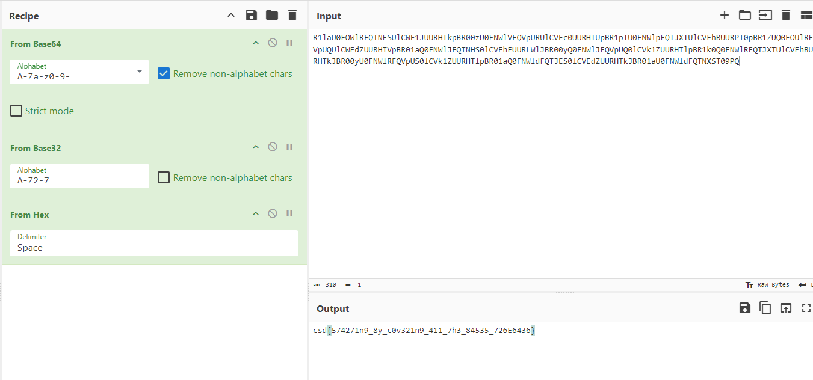

# bases

- Published: 07/23/2024 (#1/12 in round)
- Category: Cryptography
- Points: 25
- Author: Vipin

simple crypto warmup for round 6

## Attachments

- `R1laU0FOWlRFQTNESUlCWE1JUURHTkpBR00zU0FNWlVFQVpURUlCVEc0UURHTUpBR1pTU0FNWlpFQTJXTUlCVEhBUURPT0pBR1ZUQ0FOUlRFQVpUQUlCWEdZUURHTVpBR01aQ0FNWlJFQTNHS0lCVEhFUURLWlJBR00yQ0FNWlJFQVpUQ0lCVk1ZUURHTlpBR1k0Q0FNWlRFQTJXTUlCVEhBUURHTkJBR00yU0FNWlRFQVpUS0lCVk1ZUURHTlpBR01aQ0FNWldFQTJES0lCVEdZUURHTkJBR01aU0FNWldFQTNXST09PQ==`

## Hint

N/A

## Write-up

<details>
<summary>Reveal write-up</summary>

Simple challenge where you need to decode from Base64 > Base32 > Base16 (aka Hex)



Flag: ```csd{574271n9_8y_c0v321n9_411_7h3_84535_726E6436}```


</details>

Write-up by [Vipin](https://vipin.xyz)