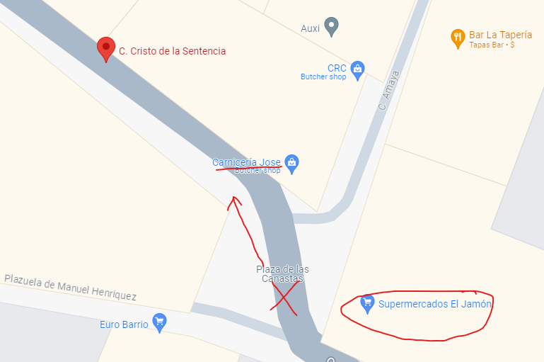
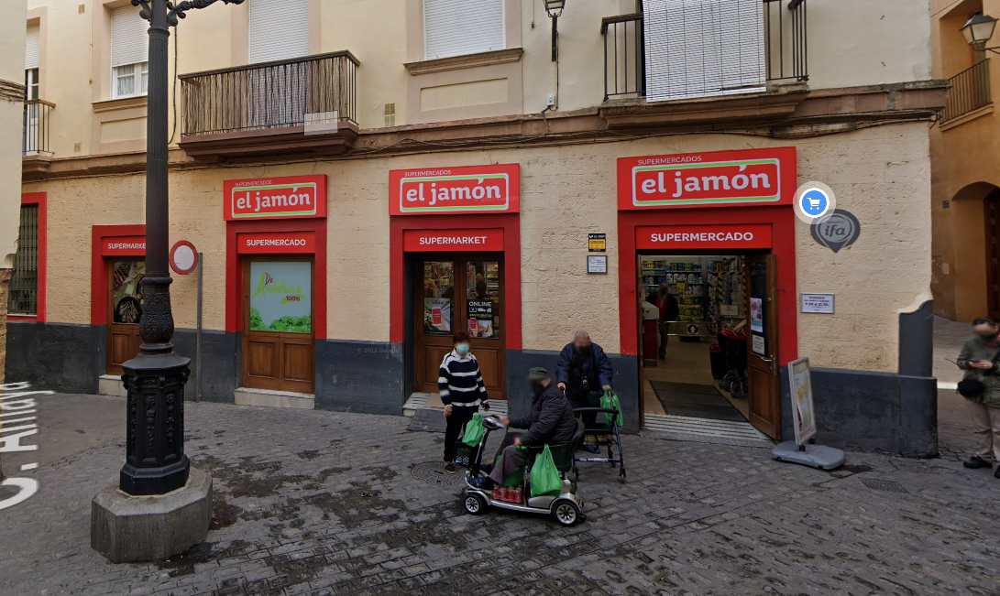

# bicyclegrinder

- Published: 08/10/2024 (#7/12 in round)
- Category: OSINT
- Points: 75
- Author: kolmus

Gotta keep those tools as sharp as your senses.
What is the English translation for the name of the store behind me? (wrap in csd{}, 1 word only -> eg. csd{word})

## Attachments

- [picture.zip](./picture.zip)

## Hint

This hint costed 5 points.

<details>
<summary>Reveal hint</summary>

not getting enough accuracy with reverse image search? try looking for clues in the image itself.

</details>

## Write-up

<details>
<summary>Reveal write-up</summary>

- If you zoom into the top right corner you'll find the street name `CALLE CRISTO DE LA SENTENCIA`
- Searching for that on Google maps, you'll find it to be located in Cádiz, Spain
- The butchers shop on the street which is also in the picture gives you the exact location and viewing angle
- Going there on street view and turning around the camera, you'll find a store named `Supermercado El Jamón`
- `El Jamòn` means ham in english





Flag: ```csd{ham}```

</details>

Write-up by kolmus
