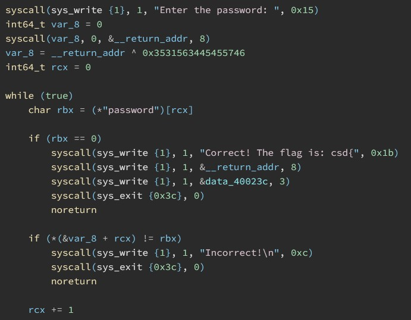

# mecrack

- Published: 08/11/2024 (#8/12 in round)
- Category: Reverse Engineering
- Points: 100
- Author: kolmus

A simple crackme to get started with reverse engineering. Figure out the password to get the flag, this time without the source code.

## Attachments

- [mecrack](mecrack)

## Hint

This hint costed 10 points.

<details>
<summary>Reveal hint</summary>

Reverse engineer the program to figure out what happens to your input. This challenge is simple enough to be solved using simple tools like objdump or gdb, but if you're not familiar with assembly, check out one of the many decompilers available online. (ex: ida, ghidra, radare2, binary ninja, and for an overwiew of different decompilers: [https://dogbolt.org/](https://dogbolt.org/)).
still stuck? the challenge takes 8 bytes of input, does one operation on them, and them compares the result to the string: "password". If you can figure out what the operation is, you can reverse it to get the correct input.

</details>

## Write-up

<details>
<summary>Reveal write-up</summary>

Here is Binary Ninja's decompilation of the program:



We can see that the program takes 8 bytes of input, and then Xors them with the value `0x3531563445455746`. After that it compares the result to the string "password" in a loop (byte per byte) until it reaches the end of the string (a null byte) or finds a mismatch. In order to get the correct input, we need to Xor the string "password" with the value `0x3531563445455746`. Of course, strings are stored in little endian, so keep that in mind when doing the xor operation.

```python
value = 0x3531563445455746
password = b'password'

result = int.from_bytes(password, 'little') ^ value

print(result.to_bytes(8, 'little')) # b'6666C9CQ'
```

And there we have it! The correct input is `6666C9CQ`. To verify this, we can run the program with this input, and indeed, it will print the flag.

Flag: ```csd{6666C9CQ}```

</details>

Write-up by kolmus
